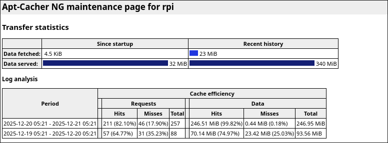

# cloud-init VM Test Harness

This repository provides a small, explicit VM-based test harness built on **libvirt**, **QEMU**, and **cloud-init**. It is designed for repeatable, disposable test environments without requiring on virt-manager or any GUI tooling.

The primary use case is testing system-level software in clean environments. The original motivation was a Go-based replacement for systemd-resolved implementing secure DNS transports (DoH, DoT, DoQ), but the tooling is generic.

---

## Design Goals

* Disposable test VMs
* No GUI dependencies
* No virt-manager required
* Reproducible builds from a known base image
* Minimal implicit behavior
* Fast iteration
* CLI-first workflow

---

## Tested host systems

#### (using included `test` directory, using the Debian's generic cloud images)

* OpenSUSE Tumbleweed Linux ✅
* Asahi Fedora Linux ✅

It is recommended to use the included `test` directory to ensure the system works as intended. If it works, the VM will show "SUCCESS" somewhere in the logs with lines of `#` above and below it as such:

```
######################################################
SUCCESS
######################################################
```

---

## High-Level Workflow

1. Maintain a **read-only base qcow2 image**
2. Create **qcow2 overlays** for each test run
3. Inject configuration via **cloud-init (NoCloud) ISO**
4. Boot using **UEFI** (required)
5. Run tests or setup logic
6. Destroy the VM and all per-run artifacts

Each run starts from a clean environment.

---

## Directory Layout

```
.
├── image-info.conf      # Base image configuration (single source of truth)
├── update.sh            # Update base cloud image
├── bring-up.sh          # Build cloud-init, create overlay, boot VM
├── bring-down.sh        # Tear down VM and clean up artifacts
├── build.sh             # Build cloud-init ISO from a directory
├── LICENSE.md
├── README.md
├── vm1/
│   ├── user-data
│   └── meta-data
├── vm2/
│   ├── user-data
│   ├── meta-data
│   └── include/         # used to include files in the generated iso's root. May be mounted by label `cidata` via cloud-init for access.
│       └── example.sh
└── vm3/
    ├── user-data
    └── meta-data
```

All scripts resolve paths **relative to their own location**, not `$HOME`. This makes execution predictable under sudo, cron, or automation.

---

## Prerequisites

* libvirt
* QEMU/KVM
* virt-install
* xorriso (for ISO creation)
* cloud-init inside the guest image

The host must have hardware virtualization enabled.

---

## Base Image Configuration

Base image and VM defaults are defined in `image-info.conf`:

```sh
BASE_URL="https://cloud.debian.org/images/cloud/trixie/latest"
IMAGE="debian-13-genericcloud-amd64.qcow2"

VM_MEMORY=2048
VM_VCPUS=2
VM_OS_VARIANT="debian13"

# default NAT config
VM_NET_MODE="libvirt"
VM_NETWORK="default"

# macvtap config
#VM_NET_MODE="macvtap"
#VM_NET_IFACE="eno1"

# dual NIC config
#VM_NET_MODE="dual"
#VM_NET_IFACE="eno1"
#VM_NETWORK="default"
```

Key points:

* The resolved base image path is `/var/lib/libvirt/ro-images/<IMAGE>` and is treated as **read-only**. Per-run VMs use qcow2 overlays backed by it.
* `VM_MEMORY`, `VM_VCPUS`, and `VM_OS_VARIANT` control the default hardware profile for new VMs.
* `VM_NET_MODE` selects between `libvirt` (NAT), `macvtap` (bridged), or `dual` (one of each). `VM_NET_IFACE` is required for the bridged interface, and `VM_NETWORK` chooses the libvirt network when applicable.
* After updating the base image, all existing overlays created from the previous version must be deleted.

---

## Scripts

### `update.sh`

Optional helper to fetch and update the base cloud image.

Responsibilities:

* Fetch `SHA512SUMS` from the configured `BASE_URL`
* Compare against the locally stored checksum
* Download the qcow2 image only when it has changed

Usage:

```bash
./update.sh
```

This script owns **base image lifecycle only** and does not interact with VMs.

---

### `build.sh`

Builds a NoCloud cloud-init ISO from a directory containing `user-data` and `meta-data`.

Expected structure:

```
<name>/
├── user-data
└── meta-data
```

Usage:

```bash
./build.sh <name>
```

Output:

```
/var/lib/libvirt/cloud-init/<name>.iso
```

This script only generates the ISO and performs no VM operations.

---

### `bring-up.sh`

Creates and boots a disposable VM.

Steps performed:

1. Builds the cloud-init ISO using `build.sh`
2. Destroys and undefines any existing VM with the same name
3. Creates a qcow2 overlay backed by the configured base image
4. Boots the VM using `virt-install`
5. Attaches to the serial console

Usage:

```bash
./bring-up.sh <name>
```

UEFI is explicitly enabled to match virt-manager behavior and avoid BIOS-related boot failures.

---

### `bring-down.sh`

Destroys and cleans up a VM and all associated artifacts.

Typical actions:

* Destroy the running VM (if present)
* Undefine the domain
* Remove the qcow2 overlay
* Remove the cloud-init ISO

Usage:

```bash
./bring-down.sh <name>
```

This leaves the system in a clean state.

---

## cloud-init Usage

cloud-init is used in **NoCloud** mode via an attached ISO.

* `user-data` contains configuration, packages, scripts, or test logic
* `meta-data` defines instance identity

* Your VM directory may have a `include/` directory. It will put any files inside it in the root of the iso in order to allow the VM to access additional files. For example, you may use `include/test.sh` then `mount --mkdir -L cidata /mnt/cidata` followed by `/mnt/cidata/test.sh` to call it.

cloud-init runs once on first boot. The VM can be configured to power off automatically after completing tests.

---

## Notes and Pitfalls

* **UEFI is mandatory** for modern Debian cloud images when using `virt-install`
* qcow2 overlays must not outlive their backing image
* Serial console output may be minimal unless kernel parameters are adjusted
* This harness intentionally avoids persistent state

---

## Philosophy

This project favors:

* explicit configuration over hidden defaults
* disposable environments over mutable systems
* reproducibility over convenience

If something breaks, the solution is usually to delete it and start again.

---

## Apt & HTTP caching

Because this harness relies on disposable VMs, the same packages and metadata are downloaded repeatedly across test runs. This is wasteful and quickly becomes a bottleneck, even on fast connections.

For this reason, using a local caching proxy is strongly recommended. While a generic HTTP proxy like Squid can work, a purpose-built package cache such as apt-cacher-ng is a significantly better fit for this workflow. It transparently caches `.deb` files and apt metadata.

In practice, apt-cacher-ng dramatically reduces network usage and speeds up repeated test runs when using this harness.

<details>
<summary>See the difference (apt-cacher-ng in use)</summary>

The following screenshot shows apt-cacher-ng statistics after repeated runs of this harness,
illustrating the reduction in external network traffic once a cache is in place.



</details>

If you use Docker, you can deploy it with the following Compose file:

<details>
<summary>Docker configuration</summary>

```yaml
services:
  apt-cacher-ng:
    image: sameersbn/apt-cacher-ng
    container_name: apt-cacher-ng
    ports:
      - "3142:3142"
    volumes:
      - apt-cacher-ng:/var/cache/apt-cacher-ng
    restart: always

volumes:
  apt-cacher-ng:
```

</details>

This exposes the service on the Docker host’s IP address. When running under libvirt’s default NAT network, this is typically `192.168.122.1`. See `test-cached` for an example of how to consume the cache.

---

## License

See [LICENSE.md](https://pubcode.archuser.org/firebadnofire/cloud-init-automation/raw/branch/main/LICENSE.md).

